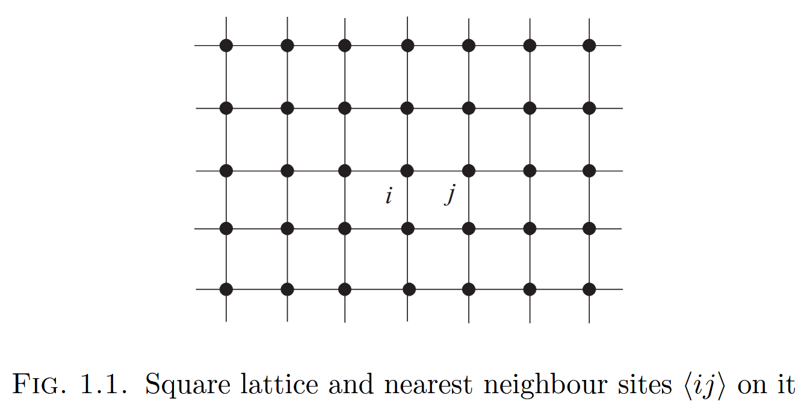
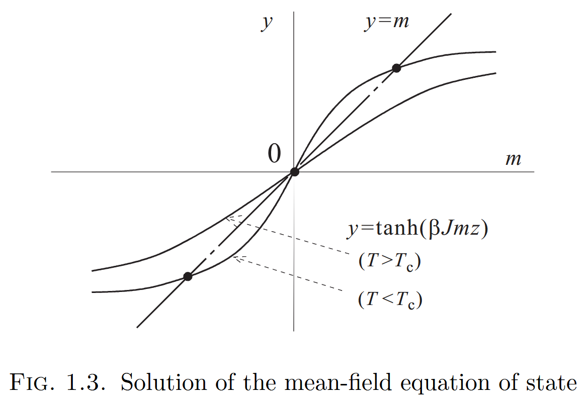
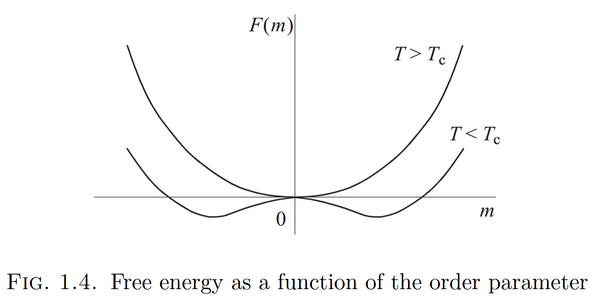
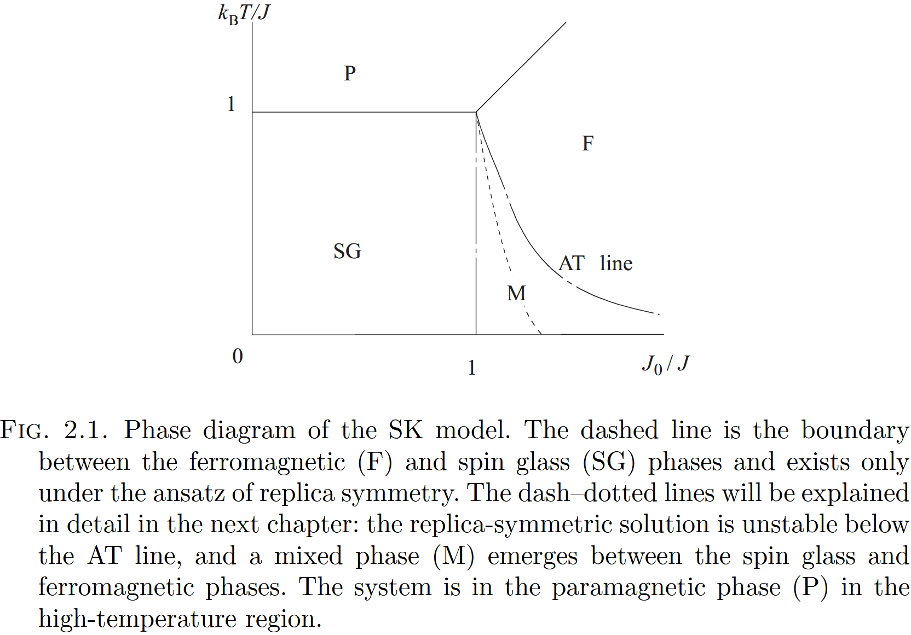

<!-- 设置detail模块的背景色 -->

Notes for *Statistical Physics of Spin Glasses and Information Processing: An Introduction - Nishimori - 2001*

# Chapter 1: Mean-field theory of phase transitions
本章介绍mean-field theory 在传统的ferromagnetic Ising model中的应用，为后续spin glasses 的讨论做准备。
## Sec. 1: Ising model

- 从1到N的整数集合$V = {i}_{i=1,\dots, N}$称为 **lattice**, 它的元素$i$是**site.** (第一部分)
- 每个site会分配一个变量$S_i$, *Ising spin* 是被描述为 $S_i = \pm 1$,表示磁矩指向上或向下。
- **bond**是指一个sites pair $(ij)$，一组适当的bond集合为$B=\{(ij)\}$,一个bond的**interaction energy**为 $-JS_iS_j$.
    > 根据问题的不同，B的选择也不同。
    > - 对于二维crystal lattice, $V$是二维空间有规则间隔的一组点，$B$中的bond $(ij)$为nearest neighbour sites 的pair.(FIG.1.1)
    > - 在 infinite-range model中， B中 bonds为 V中所有可能site pairs.

- 当$J>0$时，所有自旋同项会使得能量更低从而更稳定，成为**ferromagnetic interaction**,反之，当$J<0$时，使得自旋会处于反向平衡，称之为**antiferromagnetic interaction**。
- 当每个site有自身的能量 $-hS_i$时，总能量为$$H = -J\sum_{(ij)\in B}S_iS_j -h \sum_{i=1}^{N}S_i,$$又称为Ising model 的**Hamiltonian**.
- 当给定上面Hamiltonian后，对于各个物理量的**thermal average**是基于分布$$P(\textbf{S}) = \frac{e^{-\beta H}}{Z},$$得到的，其中$\textbf{S} = \{S_i\}$表示spin集合的状态，称为**spin configuration**. 这里取温度的单位使得Boltzmann's constant $k_B = 1$, 并且 $\beta$为温度的倒数，$\beta = 1/T$。正则化因子 $Z$为**partition function**,
$$Z= \sum_{S_1 = \pm 1}\sum_{S_2 = \pm 1}\cdots\sum_{S_N = \pm 1}e^{-\beta H} = \sum_{\textbf{S}} e^{-\beta H},$$有时使用记号$\text{Tr}$ 表示所有可能的 spin configurations 的和，因此又有$$Z=\text{Tr} e^{-\beta H}.$$
    > $P(\textbf{S})$称为**Gibbs-Boltzmann distribution**, $e^{-\beta H}$称为**Boltzmann factor**, 使用尖括号$\langle\cdots\rangle$,表示Gibbs-Boltzmann distribution的期望。
## Sec.2: Order parameter and phase transition
对于有ferromagnetic interactions 的 Ising model的一描述宏观性质的量 **magnetization**, $$m = \frac{1}{N}\left\langle\sum_{i=1}^{N}S_i\right\rangle = \frac1N\text{Tr}\left[\left(\sum_{i=1}^{N}S_i\right)P(\textbf{S})\right],\tag{Mag}$$在 **thermodynamic limit** $N \to \infty$下，刻画了宏观系统的整体有序性。
> 在适当意义下衡量宏观系统是否处于有序状态的量，称之为 **order parameter**。

在*低温条件下*，$\beta \gg 1$, 根据Gibbs-Boltzmann distribution 可知，低能态比高能态实现的概率更高，因此在无外场时（$h=0$）,几乎所有自旋都在同一方向，magnetization 接近1或-1.
随着*温度升高*，$\beta$降低，各种能态有相似的概率，自旋$S_i$从1变到-1（或反过来），系统变为无序，magnetization变为0. 

因此 magnetization $m$ 是温度 $T$ 的函数。存在临界温度 $T_c$, 对于$T<T_c$有$m\neq 0$, 而$T>T_c$有$m = 0$。(图FIG. 1.2)
> 在宏观系统中的这种现象称为**phase transition**, 并且通过 order parameter 在$=0$和$\neq 0$之间发生 sharp 和 singular 改变来刻画。

> 在magnetic系统中，对于$T<T_c$有$m\neq 0$称为 **ferromagnetic phase**,而$T>T_c$有$m = 0$称为**paramagnetic phase**, 温度 $T_c$ 称为 **critical point**或**transition point**.

## Sec.3: Mean-field theory
原则上，通过Gibbs-Boltzmann distribution, 可以计算任意物理量的期望值。然而当计算partition function时要计算$2^N$项求和，这几乎是不可能的，因此需要做适当的近似。*Mean-field theory* (or the *mean-field approximation*) 广泛应用于该情况。
### Mean-field Hamiltonian
***mean-field 的核心在于忽略微观变量在其均值(mean)附近的涨落(fluctuation)。*** 将spin变量$S_i$分解为其均值$m = \frac1N\sum_{i}\langle S_i\rangle = \langle S_i \rangle$和涨落$\delta S_i = S_i -m$, 并假设在interaction energy中涨落的二阶项可忽略。
$$
\begin{aligned}
H &=  -J\sum_{(ij)\in B}(m+\delta S_i)(m+\delta S_j) -h\sum_i S_i\\
&\approx - Jm^2N_B - Jm\sum_{(ij)\in B}(\delta S_i +\delta S_j) - h \sum_i S_i
\qquad(N_B=|B|,\text{忽略二阶}-J \sum_{(ij)\in B}\delta S_i\delta S_j)\\
& = - Jm^2N_B - Jmz\sum_i \delta S_i - h \sum_i S_i
\qquad(\text{假设每个节点度为}z)\\
& = Jm^2N_B - (Jmz+h)\sum_i S_i
\qquad(\text{把}\delta S_i = S_i -m\text{带入，且有}N_B = zN/2)\\
\end{aligned}
$$
> 期望$\langle S_i \rangle$被假定与$i$无关，根据Eq.(Mag)知$\langle S_i \rangle = m$, 在传统的的ferromagnetic Ising model中，相互作用$J$是常数，所以spins的平均序在空间中均匀。在spin glasses 和后续的其他情形下，这一假设并不成立。

从上面mean-field Hamiltonian发现相互作用的影响被暗含在magnetization $m$中，并且该问题表面上看属于非相互作用的情形（总的Hamiltonian可以被解耦为各个site的Hamiltonian,后续变分方法中更能体现）。
### Equation of state
基于mean-field Hamiltonian, 可以对各种量进行计算。如partition function,
$$
\begin{aligned}
Z&=\text{Tr} \exp\left[\beta\left\{-N_BJm^2+(Jmz+h)\sum_{i}S_i\right\}\right],\\
&=\text{e}^{-\beta N_BJm^2}\text{Tr} \prod_{i} \exp\left[\beta(Jmz+h)S_i\right],\\
&=\text{e}^{-\beta N_BJm^2}\left( \sum_{i}C_{N}^i \exp\left[\beta(Jmz+h)\right]^i\exp\left[-\beta(Jmz+h)\right]^{N-i}\right),\\
&=\text{e}^{-\beta N_BJm^2}\left\{\exp\left[\beta(Jmz+h)\right]+\exp\left[-\beta(Jmz+h)\right]\right\}^N,\\
&=\text{e}^{-\beta N_BJm^2}\left\{2\cosh\left[\beta(Jmz+h)\right]\right\}^N.
\end{aligned}
$$
类似地，可以得到magnetization $m$,
$$
\begin{aligned}
m&=\frac{\text{Tr} S_i \exp(-\beta H)}{Z},\\
 &=\frac{\text{e}^{-\beta N_BJm^2}\left\{2\cosh\left[\beta(Jmz+h)\right]\right\}^{N-1}\left\{2\sinh\left[\beta(Jmz+h)\right]\right\}}{\text{e}^{-\beta N_BJm^2}\left\{2\cosh\left[\beta(Jmz+h)\right]\right\}^N},\\
 &=\tanh\left[\beta(Jmz+h)\right].
\end{aligned}
$$
> $m=\tanh\left[\beta(Jmz+h)\right]$决定了order parameter $m$, 称为 **equation of state**.

当无外场时（$h=0$）时，magnetization称为 *spontaneous magnetization*。
从FIG. 1.3 知，$m\neq 0 $是有$y=\tanh(\beta Jmz)$在$m=0$处的斜率是否大于1所决定。对$y=\tanh(\beta Jmz)$在$m=0$处一阶展开得$y=\beta Jmz$,所以当$\beta Jz>1$时，$m\neq 0$. 因此critical point 可由$\beta Jz=Jz/T=1$得到$T_c = Jz$. 从图中知，$m$具有相同绝对值的两个正负解，这是因为所有spins反转（$S_i \to -S_i,\forall i$）所得到的，不失一般性，此后只讨论$m>0$.

### Free energy and the Landau theory
在此部分基于free energy出发来论证，通过上面计算的partition function,可以得到free energy,
$$F=-T\log Z = -NT\log\{2\cosh\beta(Jmz+h)\}+N_BJm^2.$$
当无外场时（h=0）,温度$T$接近critical point $T_c$时，$m\to 0$.所以对free energy 在$m=0$处进行幂级数展开得到，
$$F=-NT\log2+\frac{JzN}{2}(1-\beta Jz)m^2+\frac{N}{12}(Jzm)^4\beta^3.$$
注意在$T_c$时，$m^2$的系数应当改变符号（极小值改变）。正如FIG. 1.4 中，当$T<T_c$时，free energy的最小值落在$m\neq 0$,当$T>T_c$时,落在$m= 0$.

> 根据Gibbs-Boltzmann distribution得到的物理量的统计平均值，对应于该物理量在free energy取极小值的状态（thermal equilibrium state）下的取值。

因此当$T>T_c$时，magnetization 在thermal equilibrium下为0，$T<T_c$时,不为0.
> 从free energy关于oder parameter泰勒展开出发的理论称为 **Landau theory of phase transitions**.
## Sec.4: Infinite-range model
在infinite-range model （所有可能的sites pairs都有相互作用）下，mean-field theory 给出了exact solution.
infinite-range model 的Hamiltonian为，
$$H=-\frac{J}{2N}\sum_{i\neq j}S_iS_j-h\sum_{i}S_i.$$
> 对第一项的系数$-\frac{J}{2N}$，进行一些注解。因子2是由于重复计算了$S_iS_j$和$S_jS_i$。因子N是因为求和$\sum_{i\neq j}$有N(N-1)项，为了使Hamiltonian 是*extensive variable*(广延量, $\mathcal{O}(N)$).
进一步得到partition function,
$$
\begin{aligned}
Z &= \text{Tr}\exp\left(\frac{\beta J}{2N}\left(\sum_{i}S_i\right)^2-\frac{\beta J}{2}+\beta h \sum_{i}S_i\right),\\
&= \text{Tr}\exp\left(\frac{\beta J}{2N}\left(\sum_{i}S_i\right)^2+\beta h \sum_{i}S_i\right),\qquad \left(-\frac{\beta J}{2}\text{是}\mathcal{O}(N^0=1)\right)(N\to\infty)
\end{aligned}
$$
> 为了使算子$\text{Tr}$对 *整体的作用* 化简为 *作用在每一个spin* 上,那么要保证所作用的项关于$S_i$是 *线性的*。当作用项含有$\left(\sum_{i}S_i\right)^2$时，可以使用**Gaussian integral**，$$\exp(ax^2/2) = \sqrt{\frac{aN}{2\pi}}\int_{-\infty}^{\infty}\text{d} m \exp(-Nam^2/2+\sqrt{N}amx).\tag{Gaussian}$$
对其解耦，Gaussian integral的技巧是 **极其重要**的。为了使得被积分的指数函数里面是$\mathcal{O}(N)$，那么$a\sim\mathcal{O}(1),x\sim\mathcal{O}(\sqrt{N})$。

这里取$a=\beta J, x= \sum_{i}S_i/\sqrt{N}$带入上面partition function,得到
$$
\begin{aligned}
Z &= \text{Tr} \sqrt{\frac{\beta JN}{2\pi}}\int_{-\infty}^{\infty}\text{d} m \exp\left(-\frac{N\beta Jm^2 }{2}+\beta J m \sum_{i}S_i +\beta h \sum_{i}S_i\right)\\
&=\sqrt{\frac{\beta JN}{2\pi}}\int_{-\infty}^{\infty}\text{d} m \exp\left(-\frac{N\beta Jm^2 }{2}\right)\text{Tr}\exp\left(\beta (J m + h) \sum_{i}S_i\right),\\
&=\sqrt{\frac{\beta JN}{2\pi}}\int_{-\infty}^{\infty}\text{d} m \exp\left(-\frac{N\beta Jm^2 }{2}\right)\left[2\cosh\beta (J m + h)\right]^N,\\
&=\sqrt{\frac{\beta JN}{2\pi}}\int_{-\infty}^{\infty}\text{d} m \exp\left(-\frac{N\beta Jm^2 }{2}+N\log\left[2\cosh\beta (J m + h)\right]\right)\\
\tag{IR-Z}
\end{aligned}
$$
因此该问题，简化为单变量积分问题。
> 用 *steepest descent* 在thermodynamic limit $N\to \infty$下，可以估算该积分：积分在thermodynamic limit 下为被积函数的最大值。 使被积函数取最大值的 $m$ 由 *saddle-point condition* 所决定，即对指数部分进行最大化求解。

$$\frac{\partial}{\partial m}\left(-\frac{\beta Jm^2 }{2}+\log\left[2\cosh\beta (J m + h)\right]\right) = 0$$
or 
$$m=\tanh\beta(Jm+h).$$
注意该式可以由equation of state替换$J\to J/N$, 替换$z\to N$得到, 所以mean-field theory 可以得到 infinite-range model 的精确解。

> 对应到mean-field theory, 积分变量$m$的物理解释为magnetization. 另一方面，从对(IR-Z)的第一个式子直接使用saddle-point condition,得到对给定spin configuration, $$\hat{m}=\frac{1}{N}\sum_{i}S_i，$$则对所有构型满足saddle-point condition可用$$m=\left\langle\hat{m}\right\rangle= \frac{1}{N}\left\langle\sum_{i}S_i\right\rangle，$$
近似。（原文：thermodynamic limit $N\to \infty$，large numbers applies, 得到相等。） 换句话说，在infinite-range model中 magnetization 的涨落在thermodynamic limit 下消失，因此mean-field theory 给出了精确结果。

> Infinite-range model 可视为具有nearest neighbour interactions in infinit-dimensional space. 这是因为$d$-dimensional hypercubic lattice上的coordination number $z$与$d$成正比,更准确说$z=2d$（如$d=1,z=2$;$d=2,z=4$;$d=3,z=6$.）。因此，对于较大$d$,一个site与之相连的sites极多，使得涨落在大$d$的极限下，逐渐减弱，从而表现出与infinite-range model 相同的行为。
### Sec. 5: Variational approach
各种物理量计算的困难来源是于Hamiltonian中存在相互作用项造成了Gibbs-Boltzmann distribution 的复杂性。下面通过single-site distribution, $$P_i(\sigma_i)=\text{Tr}P(\textbf{S})\delta(S_i,\sigma_i),$$的乘积来近似Gibbs-Boltzmann distribution,
$$P(\textbf{S})\approx Q(\textbf{S}) = \prod_{i=1}^{N}P_i(S_i).$$

> 通过最小化自由能$F=E-TS$, 其中$E=\langle H \rangle$为系统的平均能量，$S=-\text{Tr}Q(\textbf{S})\log Q(\textbf{S})$为熵，可以得到最佳的近似分布$Q(\textbf{S})$. 该方法称为**variational method**.

自由能为，
$$
\begin{aligned}
F &= \text{Tr} Q(\textbf{S}) H(\textbf{S}) + T \text{Tr} Q(\textbf{S}) \log Q(\textbf{S}),\\
&= -J\sum_{(ij)\in B}\text{Tr}Q(\textbf{S})  S_i S_j  - h \sum_{i}\text{Tr}Q(\textbf{S})  S_i + T \sum_{i}\text{Tr} Q(\textbf{S}) \log P_i(S_i),\\
&= -J\sum_{(ij)\in B}\text{Tr}P_i(S_i)P_j(S_j)  S_i S_j  - h \sum_{i}\text{Tr}P_i(S_i)  S_i + T \sum_{i}\text{Tr} P_i(S_i) \log P_i(S_i),\\
\end{aligned}
$$
其中使用了$\text{Tr}P_i(S_i) = 1$的归一化条件。

 变分导数例子

> 若泛函$J[y(x)]$,那么$\frac{\delta J}{\delta y(x)}$的定义为：
> 先对$y(x)$做微小变化$\delta y(x)$, $J$的变化为$\delta J = J[y(x)+\delta y(x)] - J[y(x)]$, 那么若存在函数$f(x)$使得$\delta J = \int f(x)\delta y(x) \text{d}x$,那么定义$\frac{\delta J}{\delta y(x)} = f(x)$.

> **例子**
> 1. $J[y(x)] = \int y(x)^2 \text{D}x$, 那么$$\delta J = \int (y(x)+\delta y(x))^2 \text{D}x - \int y(x)^2 \text{D}x = \int 2y(x)\delta y(x) \text{D}x + \int (\delta y(x))^2 \text{D}x.$$ 忽略二阶小量，得到$\delta J = \int 2y(x)\delta y(x) \text{D}x$, 因此$\frac{\delta J}{\delta y(x)} = 2y(x)$。
> 2. $J[y(x)] = \int  y(x)f(x)\text{D}x$, 那么$$\delta J =J[y(x)+\delta y(x)] - J[y(x)] = \int  \delta y(x)f(x)\text{D}x.$$因此$\frac{\delta J}{\delta y(x)} = f(x)$。
> 3. $J[y(x)] = \int  y(x)\log y(x)\text{D}x$, 那么$$\begin{aligned}
    \delta J &=J[y(x)+\delta y(x)] - J[y(x)] \\
    &= \int  \left\{(y(x)+\delta y(x))\log(y(x)+\delta y(x)) - y(x)\log y(x)\right\}\text{D}x.
    \end{aligned}$$对$\log(y(x)+\delta y(x))$在$y(x)$处一阶展开，得到$$\begin{aligned}
\delta J &= \int  \left\{(y(x)+\delta y(x))\left(\log y(x) + \frac{\delta y(x)}{y(x)}\right) - y(x)\log y(x)\right\}\text{D}x\\
&= \int  \left\{\delta y(x)\log y(x) + \delta y(x)\right\}\text{D}x.
\end{aligned}$$因此$\frac{\delta J}{\delta y(x)} = \log y(x) + 1$。

那么对$P_i(S_i)$进行变分，得到
$$
\begin{aligned}
&\frac{\delta \left\{F + \sum_{i}\lambda_i\left(\text{Tr}P_i(S_i)-1\right)\right\}}{\delta P_i(S_i)}\\
&=
-J\sum_{j\in \partial i}\text{Tr}P_j(S_j) S_i S_j - h S_i + T\left(\log P_i(S_i) +1\right) + \lambda_i,\\
&=-J\sum_{j\in \partial i}m_j S_i - h S_i + T\log P_i(S_i) + T + \lambda_i,\qquad (m_j=\text{Tr}P_j(S_j)S_j)\\
\end{aligned}
$$
其中$\lambda_i$为拉格朗日乘子。令上式为0，得到
$$
\begin{aligned}
P_i(S_i) &= \exp\left\{\beta\left(J\sum_{j\in \partial i}m_j + h\right)S_i -1 - \frac{\lambda_i}{T}\right\},\\
&= \frac{\exp\left\{\beta\left(J\sum_{j\in \partial i}m_j + h\right)S_i\right\}}{2\cosh\left\{\beta\left(J\sum_{j\in \partial i}m_j + h\right)\right\}},\\
\end{aligned}
$$
其中使用了归一化条件$\text{Tr}P_i(S_i)=1$. 

> 若假设所有site的magnetization相同$m_i=m$, $$Q(\textbf{S}) \propto \exp\left\{\beta\left(Jzm + h\right)\sum_{i=1}^{N}S_i\right\},$$所对应的解耦的Hamiltonian，$H=-\beta\left(Jzm + h\right)\sum_{i=1}^{N}S_i$与前面得到的mean-field Hamiltonian只差一个常数。注意：至此未使用$S_i=\pm 1$,因此结论是普遍的。若使用该条件到上面$P_i(S_i)$，得到的equation of state为，$$m = \tanh\left[\beta(Jzm + h)\right].$$
与mean-field theory的equation of state相同。

另一方面考虑$S_i=\pm 1$时，可以使用$m_i$表示$P_i(S_i)$，即$$P_i(S_i) = \frac{1+m_i S_i}{2},$$这与$m_i = \text{Tr}S_i P_i(S_i)$封闭。将其带入上面的自由能表达式，得到
$$
\begin{aligned}
F &= -J\sum_{(ij)\in B}m_i m_j - h \sum_{i}m_i + T \sum_{i}\left\{\frac{1+m_i}{2}\log\frac{1+m_i}{2}+\frac{1-m_i}{2}\log\frac{1-m_i}{2}\right\}.\\
\end{aligned}
$$
对$m_i$进行变分，得到
$$m_i = \tanh\left[\beta\left(J\sum_{j\in \partial i}m_j + h\right)\right],$$
若假设所有site的magnetization相同$m_i=m$, 则得到与mean-field theory相同的equation of state.

# Chapter 2: Mean-field theory of spin glasses
在本章节讨论spin glasses 的问题，即相互作用$J_{ij}$在不同的bond上是随机分布的情形。在此情景下，会出现frustration现象，即无法使得所有相互作用能量都达到最低。此时出现自旋在空间上随机分布，但时间上冻结的现象，即**spin glass phase**。本节将介绍mean-field theory 在spin glasses 中的应用。探究spin glass phase 存在的条件，并重点阐明“replica-symmetric solution”的特性。
Replica method 是非常重要的分析工具。  

## Sec. 1: Spin glass and Edwards-Anderson model
**为何叫做spin glass?** 因为其类似于普通的玻璃材料，原子在空间上随机分布，但时间上冻结。类似地，spin glass 中的自旋在空间上随机分布，但时间上冻结。 例如，在金属中掺杂少量的铁原子（Fe）会导致spin glass 行为。铁原子之间的相互作用通过周围的导电电子介导，这种间接相互作用称为RKKY interaction, 它是振荡函数，因此不同距离的铁原子之间可能是ferromagnetic interaction 或antiferromagnetic interaction，从而导致frustration现象。

Mean-field theory 已经证实当低温时，当spin之间存在特定类型的随机相互作用时，系统会进入spin glass phase。本章以及下章介绍mean-field theory 在spin glasses 中的应用。

本章将首先引入随机系统模型，并解释分析随机系统的通用方法**replica method**。随后，给出 replica-symmetric solution。

### Edwards-Anderson model
该模型(无外场情况)的Hamiltonian为，$$H = - \sum_{(ij)\in B} J_{ij} S_i S_j, \qquad S_i = \pm 1 \ (\text{Ising type}).\tag{EA-H}$$
其中$J_{ij}$为随机变量，服从某一概率分布$P(J_{ij})$, 
$$P(J_{ij}) = \frac{1}{\sqrt{2\pi J^2}}\exp\left\{-\frac{(J_{ij}-J_0)^2}{2J^2}\right\},\ (Gaussian\ model),$$
$$P(J_{ij}) = p\delta(J_{ij}-J) + (1-p)\delta(J_{ij}+J),\ (±J\ model).$$
通常来讲sites 的无序性相比于bonds 的无序性对系统的影响较小，因此$J_{ij}$假定是独立同分布的随机变量。
### Quenched system and configurational average
对于一组给定的（quenched）满足分布$P(J_{ij})$的相互作用$\{J_{ij}\}$, 对（EA-H）中的spin 变量 $\textbf{S}=\{S_i\}$上使用trace operation，能计算各种物理量的thermal average。例如 free energy,$$F(\textbf{J}) = -T\log \text{Tr} \exp(-\beta H),$$
其中$\textbf{J}\equiv\{J_{ij}\}$。 然后对$\textbf{J}$进行平均，得到**configurational average**（$[\cdots]$表示对相互作用的configurational average）,
$$[F] = -T[\log Z] = - T\int \prod_{(ij)\in B}\text{d}J_{ij} P(J_{ij}) \log Z.$$
- $F(\textbf{J})$得到的时候是对spin configuration 求和的结果，而$[F]$是对相互作用configurations 求平均的结果。
- $[F]$称为averaged free energy, 其对外场$h$或温度$T$的微分可以得到magnetization或internal energy等物理量的configurational average.
- 这里之所以先固定相互作用$\textbf{J}$, 对spin configuration 求和，是因为携带spin的原子在空间中的位置是随机分布的，但在spin快速热运动的时间尺度上的固定的。因此称之为**quenched system**.
- 在thermodynamic limit $N\to \infty$下，$f(\textbf{J}) = F(\textbf{J})/N$的涨落消失，因此$f(\textbf{J})$的值以概率1等于其configurational average $[f] = [F]/N$，称为**self-averaging property**. 因此实际上我们选择计算不显式依赖$\textbf{J}$的$[f]$。
### Replica method
为了解决上面计算$[\log Z]$的问题，利用以下恒等式，
$$[\log Z] = \lim_{n\to 0}\frac{[Z^n]-1}{n}.\tag{Replica}$$
这种制备原始系统的n个副本(replica)，计算其partition function 的cofigurational average $[Z^n]$, 然后对$n$做解析延拓到0的极限，称为**replica method**.  (这里解析延拓的合理性尚无严格证明，但在许多情况下得到了与数值模拟一致的结果，因此被广泛使用。)
## Sec. 2: Sherrington-Kirkpatrick model
### Sherrington-Kirkpatrick model
对于infinite-range model 的Edwards-Anderson model, 即Sherrington-Kirkpatrick (SK) model, Hamiltonian为，
$$H = - \sum_{i<j} J_{ij} S_i S_j-h\sum_{i} S_i,\tag{SK-H}$$
其中$J_{ij}$是一个quenched variable 服从Gaussian distribution,
$$P(J_{ij}) = \frac{1}{J}\sqrt{\frac{N}{2\pi}}\exp\left\{-\frac{N}{2J^2}\left(J_{ij}-\frac{J_0}{N}\right)^2\right\},$$
其中$$[J_{ij}]=\frac{J_0}{N},\quad [(\Delta J_{ij})^2]=\frac{J^2}{N},$$
这里的normalization是为了使得extensive quantities (如energy)与$N$成正比。
### Replica average of the partition function
基于(replica)式, 需要计算$[Z^n]$. 对于$n$个replicas, Hamiltonian为，
$$H^n = - \sum_{a=1}^{n}\left(\sum_{i<j} J_{ij} S_i^{\alpha} S_j^{\alpha} + h\sum_{i} S_i^{\alpha}\right),$$
其中${\alpha}=1,2,\dots,n$为replica index. 因此n次幂 partition
function的the configuration average，
$$ [Z^n] =\int \
\left(\prod_{i<j}\text{d}J_{ij} P(J_{ij})\right)\text{Tr} \exp\left(\beta \sum_{a=1}^{n}\sum_{i<j} J_{ij} S_i^{\alpha} S_j^{\alpha} + \beta h \sum_{a=1}^{n}\sum_{i} S_i^{\alpha}\right).$$

 计算细节

计算思路，1. 先把$J_{ij}$积分掉,2. 重新整理指标$i,j$和$\alpha,\beta$.

$$
\begin{aligned} 
[Z^n] &=\int \
\left(\prod_{i<j}\text{d}J_{ij} P(J_{ij})\right)\text{Tr} \exp\left(\beta \sum_{\alpha=1}^{n}\sum_{i<j} J_{ij} S_i^{\alpha} S_j^{\alpha} + \beta h \sum_{\alpha=1}^{n}\sum_{i} S_i^{\alpha}\right),\\
&=\text{Tr} \exp\left(\beta h \sum_{\alpha=1}^{n}\sum_{i} S_i^{\alpha}\right) \prod_{i<j}\int \text{d}J_{ij} P(J_{ij})\exp\left(\beta J_{ij}\sum_{\alpha=1}^{n} S_i^{\alpha} S_j^{\alpha}\right),\\
&=\text{Tr} \exp\left(\beta h \sum_{\alpha=1}^{n}\sum_{i} S_i^{\alpha}\right) \prod_{i<j}\int \text{d}J_{ij} \frac{1}{J}\sqrt{\frac{N}{2\pi}}\exp\left\{-\frac{N}{2J^2}\left(J_{ij}-\frac{J_0}{N}\right)^2 + \beta J_{ij}\sum_{\alpha=1}^{n} S_i^{\alpha} S_j^{\alpha}\right\},\\
&=\cdots\exp\left\{-\frac{N}{2J^2}\left(J_{ij}^2-2\left[\frac{J_0}{N}+\frac{J^2\beta}{N}\sum_{\alpha=1}^{n} S_i^{\alpha} S_j^{\alpha}\right]J_{ij}+\frac{J_0^2}{N^2}\right)\right\},\\
&=\cdots\exp\left\{-\frac{N}{2J^2}\left(J_{ij}-\left[\frac{J_0}{N}+\frac{J^2\beta}{N}\sum_{\alpha=1}^{n} S_i^{\alpha} S_j^{\alpha}\right]\right)^2+\frac{N}{2J^2}\left(\left(\frac{J_0}{N}+\frac{J^2\beta}{N}\sum_{\alpha=1}^{n} S_i^{\alpha} S_j^{\alpha}\right)^2-\frac{J_0^2}{N^2}\right)\right\},\\
&=\cdots\exp\left\{-\frac{N}{2J^2}\left(J_{ij}-\left[\frac{J_0}{N}+\frac{J^2\beta}{N}\sum_{\alpha=1}^{n} S_i^{\alpha} S_j^{\alpha}\right]\right)^2+\left(\frac{J^2\beta^2}{2N}\left(\sum_{\alpha=1}^{n} S_i^{\alpha} S_j^{\alpha}\right)^2+\frac{J_0\beta}{N}\sum_{\alpha=1}^{n} S_i^{\alpha} S_j^{\alpha}\right)\right\},\\
&=\text{Tr} \exp\left(\beta h \sum_{\alpha=1}^{n}\sum_{i} S_i^{\alpha}\right) \prod_{i<j}\exp\left\{\frac{\beta J_0}{N}\sum_{\alpha=1}^{n} S_i^{\alpha} S_j^{\alpha} + \frac{(\beta J)^2}{2N}\left(\sum_{\alpha=1}^{n} S_i^{\alpha} S_j^{\alpha}\right)^2\right\},\\
&=\text{Tr} \exp\left\{\frac{1}{N}\sum_{i<j}\left(\frac{1}{2}\beta^2 J^2\sum_{\alpha,\beta} S_i^{\alpha} S_j^{\alpha}S_i^{\beta} S_j^{\beta}+\beta J_0\sum_{\alpha=1}^{n} S_i^{\alpha} S_j^{\alpha}\right)+\beta h \sum_{\alpha=1}^{n}\sum_{i} S_i^{\alpha}\right\},\\
&上面是先把J_{ij}积分掉，后面是重新整理i,j和\alpha,\beta指标。\\
&=\text{Tr} \exp\left\{\frac{1}{N}\left(\frac{1}{2}\beta^2 J^2\sum_{\alpha,\beta} \sum_{i<j}(S_i^{\alpha} S_i^{\beta})(S_j^{\alpha} S_j^{\beta})+\beta J_0\sum_{\alpha=1}^{n} \sum_{i<j}S_i^{\alpha} S_j^{\alpha}\right)+\cdots\right\},\\
&=\text{Tr} \exp\left\{\frac{1}{2N}\left(\frac{1}{2}\beta^2 J^2\sum_{\alpha,\beta} \left(\sum_{i}S_i^{\alpha} S_i^{\beta}\right)^2+\beta J_0\sum_{\alpha=1}^{n} \left(\sum_{i}S_i^{\alpha}\right)^2-\frac{1}{2}\beta^2 J^2n^2N-\beta J_0nN\right)+\cdots\right\},\\
&因为\frac{-\beta^2 J^2n^2N-2\beta J_0nN}{4N}\sim\mathcal{O}(1),其他项都是\mathcal{O}(N),所以\\
&=\text{Tr} \exp\left\{\frac{1}{2N}\left(\frac{1}{2}\beta^2 J^2\sum_{\alpha,\beta} \left(\sum_{i}S_i^{\alpha} S_i^{\beta}\right)^2+\beta J_0\sum_{\alpha=1}^{n} \left(\sum_{i}S_i^{\alpha}\right)^2\right)+\cdots\right\},\\
&=\text{Tr} \exp\left\{\left(\frac{\beta^2 J^2}{2N}\sum_{\alpha<\beta} \left(\sum_{i}S_i^{\alpha} S_i^{\beta}\right)^2+\frac{\beta J_0}{2N}\sum_{\alpha=1}^{n} \left(\sum_{i}S_i^{\alpha}\right)^2+\frac{\beta^2 J^2nN^2}{4N}\right)+\cdots\right\},\\
&=\exp\left(\frac{\beta^2 J^2nN}{4}\right)\text{Tr} \exp\left\{\frac{\beta^2 J^2}{2N}\sum_{\alpha<\beta} \left(\sum_{i}S_i^{\alpha} S_i^{\beta}\right)^2+\frac{\beta J_0}{2N}\sum_{\alpha} \left(\sum_{i}S_i^{\alpha}\right)^2+\beta h \sum_{\alpha}\sum_{i} S_i^{\alpha}\right\},\\
\end{aligned}
$$

因此得到，
$$[Z^n]=\exp\left(\frac{\beta^2 J^2nN}{4}\right)\text{Tr} \exp\left\{\frac{\beta^2 J^2}{2N}\sum_{\alpha<\beta} \left(\sum_{i}S_i^{\alpha} S_i^{\beta}\right)^2+\frac{\beta J_0}{2N}\sum_{\alpha} \left(\sum_{i}S_i^{\alpha}\right)^2+\beta h \sum_{\alpha}\sum_{i} S_i^{\alpha}\right\}.$$
### Linearization of the interaction terms
如果指数中的量是spin 的线性组合，那么trace operation 可以简化为作用在每一个spin 上的乘积。但目前指数中含有$\left(\sum_{i}S_i^{\alpha} S_i^{\beta}\right)^2$和$\left(\sum_{i}S_i^{\alpha}\right)^2$，因此需要使用**Gaussian integral** (Gaussian)对其进行解耦(linearization)。

这里取$a_{\alpha\beta}=\beta^2 J^2, x_{\alpha\beta}=\sum_{i}S_i^{\alpha} S_i^{\beta}/\sqrt{N}$,$a_{\alpha}=\beta J_0, x_{\alpha}=\sum_{i}S_i^{\alpha}/\sqrt{N}$ 带入Gaussian integral, 对每一对$(\alpha,\beta)$和$(\alpha)$进行解耦，得到
$$ 
\begin{aligned}
[Z^n] &=\exp\left(\frac{\beta^2 J^2nN}{4}\right) \text{Tr} \prod_{\alpha<\beta}\sqrt{\frac{N\beta^2 J^2}{2\pi}}\int_{-\infty}^{\infty}\text{d}q_{\alpha\beta} \exp\left(-\frac{N\beta^2 J^2 q_{\alpha\beta}^2}{2}+\beta^2 J^2  q_{\alpha\beta}\sum_{i}S_i^{\alpha} S_i^{\beta}\right)\\
&\quad\times \prod_{\alpha}\sqrt{\frac{N\beta J_0}{2\pi}}\int_{-\infty}^{\infty}\text{d}m_{\alpha} \exp\left(-\frac{N\beta J_0 m_{\alpha}^2}{2}+ \beta J_0  m_{\alpha} \sum_{i}S_i^{\alpha}\right)\exp\left(\beta h \sum_{\alpha}\sum_{i} S_i^{\alpha}\right),\\
&由于\sqrt{\frac{N\beta^2 J^2}{2\pi}}和\sqrt{\frac{N\beta J_0}{2\pi}}相对指数项可以忽略，所以\\
&=\exp\left(\frac{\beta^2 J^2nN}{4}\right) \text{Tr} \int_{-\infty}^{\infty}\prod_{\alpha<\beta}\text{d}q_{\alpha\beta} \exp\left(-\frac{N\beta^2 J^2 }{2}\sum_{\alpha<\beta}q_{\alpha\beta}^2+\beta^2 J^2  \sum_{\alpha<\beta}q_{\alpha\beta}\sum_{i}S_i^{\alpha} S_i^{\beta}\right)\\
&\quad\times \int_{-\infty}^{\infty}\prod_{\alpha}\text{d}m_{\alpha} \exp\left(-\frac{N\beta J_0 }{2}\sum_{\alpha}m_{\alpha}^2+ \beta J_0  \sum_{\alpha}m_{\alpha} \sum_{i}S_i^{\alpha}\right)\exp\left(\beta h \sum_{\alpha}\sum_{i} S_i^{\alpha}\right),\\
&=\exp\left(\frac{\beta^2 J^2nN}{4}\right)  \int_{-\infty}^{\infty}\left(\prod_{\alpha<\beta}\text{d}q_{\alpha\beta}\right)\left(\prod_{\alpha}\text{d}m_{\alpha}\right) \exp\left(-\frac{N\beta^2 J^2 }{2}\sum_{\alpha<\beta}q_{\alpha\beta}^2-\frac{N\beta J_0 }{2}\sum_{\alpha}m_{\alpha}^2\right)\\
&\quad\times \text{Tr} \exp\left(\beta^2 J^2  \sum_{\alpha<\beta}q_{\alpha\beta}\sum_{i}S_i^{\alpha} S_i^{\beta}+ \beta J_0  \sum_{\alpha}m_{\alpha} \sum_{i}S_i^{\alpha}\right)\exp\left(\beta h \sum_{\alpha}\sum_{i} S_i^{\alpha}\right),\\
&=\exp\left(\frac{\beta^2 J^2nN}{4}\right)  \int_{-\infty}^{\infty}\left(\prod_{\alpha<\beta}\text{d}q_{\alpha\beta}\right)\left(\prod_{\alpha}\text{d}m_{\alpha}\right) \exp\left(-\frac{N\beta^2 J^2 }{2}\sum_{\alpha<\beta}q_{\alpha\beta}^2-\frac{N\beta J_0 }{2}\sum_{\alpha}m_{\alpha}^2\right)\\
&\quad\times \text{Tr} \exp\left(\beta^2 J^2  \sum_{\alpha<\beta}q_{\alpha\beta}\sum_{i}S_i^{\alpha} S_i^{\beta}+ \beta  \sum_{\alpha}(J_0 m_{\alpha} +h)\sum_{i}S_i^{\alpha}\right),\\
\end{aligned}
$$
因为取对$i$的trace,且每一项都是$i$的线性组合，因此可以写成乘积形式，
$$
\begin{aligned}
\text{Tr} &\exp\left(\beta^2 J^2  \sum_{\alpha<\beta}q_{\alpha\beta}\sum_{i}S_i^{\alpha} S_i^{\beta}+ \beta  \sum_{\alpha}(J_0 m_{\alpha} +h)\sum_{i}S_i^{\alpha}\right)\\
&=\left(\text{Tr} \exp\left(\beta^2 J^2  \sum_{\alpha<\beta}q_{\alpha\beta}S^{\alpha} S^{\beta}+ \beta  \sum_{\alpha}(J_0 m_{\alpha} +h)S^{\alpha}\right)\right)^N\\
&\equiv\exp\left(N\log \text{Tr} \text{ e}^L\right).\\
其中\quad L &= \beta^2 J^2  \sum_{\alpha<\beta}q_{\alpha\beta}S^{\alpha} S^{\beta}+ \beta  \sum_{\alpha}(J_0 m_{\alpha} +h)S^{\alpha}.\\
\end{aligned}
$$
所以
$$
\begin{aligned}
[Z^n] =&\exp\left(\frac{\beta^2 J^2nN}{4}\right) \int_{-\infty}^{\infty}\left(\prod_{\alpha<\beta}\text{d}q_{\alpha\beta}\right)\left(\prod_{\alpha}\text{d}m_{\alpha}\right)\\
&\exp\left(-\frac{N\beta^2 J^2 }{2}\sum_{\alpha<\beta}q_{\alpha\beta}^2-\frac{N\beta J_0 }{2}\sum_{\alpha}m_{\alpha}^2 + N\log \text{Tr} \text{ e}^L\right),\tag{PF-Zn}\\
\end{aligned}   
$$
### Steepest descent method
由于上面被积函数的指数部分与$N$成正比，因此在thermodynamic limit $N\to \infty$下，可以使用steepest descent method 估算该积分。使得指数部分取最大值的$q_{\alpha\beta},(\alpha\neq\beta)$和$m_{\alpha}$由saddle-point condition 决定, 即对$q_{\alpha\beta}$和$m_{\alpha}$分别求导数并令其为0。
$$
\frac{\partial}{\partial q_{\alpha\beta}}\left(-\frac{\beta^2 J^2 }{2}\sum_{\alpha<\beta}q_{\alpha\beta}^2 + \log \text{Tr} \text{ e}^L\right) = 0,
$$
$$
\frac{\partial}{\partial m_{\alpha}}\left(-\frac{\beta J_0 }{2}\sum_{\alpha}m_{\alpha}^2 + \log \text{Tr} \text{ e}^L\right) = 0.
$$
计算得到，
$$
q_{\alpha\beta} = \frac{1}{\beta^2J^2}\frac{\partial}{\partial q_{\alpha\beta}}\log \text{Tr} \text{ e}^L= \frac{\text{Tr} S^{\alpha} S^{\beta} \text{ e}^L}{\text{Tr} \text{ e}^L} = \langle S^{\alpha} S^{\beta} \rangle_L,\tag{Saddle-q}
$$
$$
m_{\alpha} = \frac{1}{\beta J_0}\frac{\partial}{\partial m_{\alpha}}\log \text{Tr} \text{ e}^L= \frac{\text{Tr} S^{\alpha} \text{ e}^L}{\text{Tr} \text{ e}^L} = \langle S^{\alpha} \rangle_L,\tag{Saddle-m}
$$
进一步使用steepest descent method，得到
$$
\begin{aligned}
[Z^n] &\approx \exp\left(-\frac{N\beta^2 J^2 }{2}\sum_{\alpha<\beta}q_{\alpha\beta}^2-\frac{N\beta J_0 }{2}\sum_{\alpha}m_{\alpha}^2 + N\log \text{Tr} \text{ e}^L+\frac{\beta^2 J^2nN}{4}\right),\quad (利用了N\to\infty)\\
&\approx 1+Nn\left(-\frac{\beta^2 J^2 }{2n}\sum_{\alpha<\beta}q_{\alpha\beta}^2-\frac{\beta J_0 }{2n}\sum_{\alpha}m_{\alpha}^2 + \frac{1}{n}\log \text{Tr} \text{ e}^L+\frac{\beta^2 J^2}{4}\right),\quad (利用了n\to 0)\\
&= 1+Nn\left\{-\frac{\beta^2 J^2 }{4n}\sum_{\alpha\neq\beta}q_{\alpha\beta}^2-\frac{\beta J_0 }{2n}\sum_{\alpha}m_{\alpha}^2 + \frac{1}{n}\log \text{Tr} \text{ e}^L+\frac{\beta^2 J^2}{4}\right\},\\
\end{aligned}
$$
所以上面是对充分大且有限的$N$和充分小的$n$进行近似。
因此根据(replica)式，得到averaged free energy为，
$$
\begin{aligned}
-\beta[f] &= \lim_{n\to 0}\frac{[Z^n]-1}{nN}\\
&= \lim_{n\to 0}\left\{-\frac{\beta^2 J^2 }{4n}\sum_{\alpha\neq\beta}q_{\alpha\beta}^2-\frac{\beta J_0 }{2n}\sum_{\alpha}m_{\alpha}^2 + \frac{1}{n}\log \text{Tr} \text{ e}^L+\frac{\beta^2 J^2}{4}\right\}.\tag{R-FE}
\end{aligned}
$$
### Order parameters
上一节中引入的$q_{\alpha\beta}$和$m_{\alpha}$最初是为了线性化interaction term 而引入的辅助变量，但通过saddle-point condition 可以看出它们实际上是系统的物理量，分别为不同replica 之间的overlap和每个replica 的magnetization。（类似Ising模型中的处理。）

为了说明物理意义,首先定义$$H_{\gamma} = -\sum_{i<j}J_{ij} S_i^{\gamma} S_j^{\gamma}-h\sum_{i}S_i^{\gamma}.$$我们要计算，在$n\to 0$下，
$$
q_{\alpha\beta} = [\langle S_i^{\alpha} S_i^{\beta} \rangle]=\left[\frac{\text{Tr} S_i^{\alpha} S_i^{\beta} \exp(-\beta \sum_{\gamma}H_{\gamma})}{\text{Tr}\exp(-\beta \sum_{\gamma}H_{\gamma})}\right]\tag{R-overlap}
$$

$$
m_{\alpha} = [\langle S_i^{\alpha} \rangle]=\left[\frac{\text{Tr} S_i^{\alpha} \exp(-\beta \sum_{\gamma}H_{\gamma})}{\text{Tr} \exp(-\beta \sum_{\gamma}H_{\gamma})}\right]\tag{R-magnet},
$$

 计算细节

下面要说明
$
\frac{\text{Tr} S^{\alpha} S^{\beta} \text{ e}^L}{\text{Tr} \text{ e}^L} 与\left[\frac{\text{Tr} S_i^{\alpha} S_i^{\beta} \exp(-\beta \sum_{\gamma}H_{\gamma})}{\text{Tr}\exp(-\beta \sum_{\gamma}H_{\gamma})}\right]
$相等。

首先对于分母,当$n\to 0$时，
$$\text{Tr} \text{ e}^L=1,(\text{因为从(R-FE)},\log \text{Tr} \text{ e}^L\sim \mathcal{O}(n))$$
$$\text{Tr}\exp(-\beta \sum_{\gamma}H_{\gamma})=1$$
所以分母都为1。

对于分子,
$$
\begin{aligned}
\left[\text{Tr} S_i^{\alpha} S_i^{\beta} \exp(-\beta \sum_{\gamma}H_{\gamma})\right] &= \left(\text{Tr}\text{ e}^L\right)^{N-1}\text{Tr}(S^{\alpha} S^{\beta}\text{ e}^L)=\text{Tr}(S^{\alpha} S^{\beta}\text{ e}^L)\\
\end{aligned}
$$
第一个等号的计算与$[Z^n]$过程类似，第二个等式是因为分母类似。

对于$m_{\alpha}$,
$
\frac{\text{Tr} S^{\alpha}\text{ e}^L}{\text{Tr} \text{ e}^L} 与\left[\frac{\text{Tr} S_i^{\alpha}\exp(-\beta \sum_{\gamma}H_{\gamma})}{\text{Tr}\exp(-\beta \sum_{\gamma}H_{\gamma})}\right]
$相等类似上面计算。

在此，如果$m_{\alpha}$独立于$\alpha$时，这与常规的ferromagnetic magnetization相对应。参数$q_{\alpha\beta}$是spin glass order parameter, 这是对除去$\alpha,\beta$副本之外其他所有副本取trace 后式(R-overlap)分子分母相抵消。因此当**无法区分各个replica**时，
$$q_{\alpha\beta} =\left[\frac{\text{Tr} S_i^{\alpha}\text{ e}^{-\beta H_{\alpha}}}{\text{Tr} \text{ e}^{-\beta H_{\alpha}}}\frac{\text{Tr} S_i^{\beta}\text{ e}^{-\beta H_{\beta}}}{\text{Tr} \text{ e}^{-\beta H_{\beta}}}\right]=[\langle S_i^{\alpha} \rangle\langle S_i^{\beta} \rangle] =[\langle S_i \rangle^2]\equiv q.$$

- 在 **paramagnetic phase at high temperature**, 在任意的replica, 每个site $i$, 有$\langle S_i \rangle=0$, 因此$m=q=0$.
- 在 **ferromagnetic phase**, 具有几乎空间均匀的序，若选择序的方向为正项，则在大多数site有$\langle S_i \rangle>0$, 因此 $m>0$ 和 $q>0$.
- 在 **spin glass phase at low temperature**, spin在空间上随机分布，但时间上冻结，因此在每个site $i$, 有$\langle S_i \rangle\neq 0$, 但其符号随机分布，因此有可能$m=[\langle S_i \rangle]=0$, 但$q=[\langle S_i \rangle^2]>0$. 因此$q$可以作为spin glass phase 的order parameter.
## Sec. 3:  Replica-symmetric solution
### Equation of state
为了求解(R-FE), 且$q_{\alpha\beta}$和$m_{\alpha}$的值，有saddle-point conditions (Saddle-q)和(Saddle-m). 在此式子中，replica index 是需要被明确处理的。但直观上，系统的物理性质不应依赖于replica index 的标号，因此假设**replica symmetry**,
$$q_{\alpha\beta} = q, \quad (\alpha\neq\beta),\qquad m_{\alpha} = m.$$
所以从(R-FE)和$L$的定义，可以得到
$$ -\beta[f] = \frac{\beta^2 J^2 }{4}(1-q)^2 - \frac{\beta J_0 }{2}m^2 + \int\text{D}z\log \left[2\cosh\beta\tilde{H}(z)\right].\tag{RS-FE}$$
其中$\text{D}z$为Gaussian measure，有 $\text{D}z=\text{d}z \exp(-z^2/2)/\sqrt{2\pi}$， 以及$\tilde{H}(z) = J\sqrt{q}z + J_0 m + h$.

 计算细节

从(R-FE)可以得到，
$$ -\beta[f] = -\frac{\beta^2 J^2 }{4}(n-1)q^2 - \frac{\beta J_0 }{2}m^2 + \frac{1}{n}\log \text{Tr} \text{ e}^L + \frac{\beta^2 J^2}{4}\quad (n\to 0).$$
下面单独考虑$\log \text{Tr} \text{ e}^L,$其中$L=\beta^2J^2q\sum_{\alpha<\beta}S^{\alpha}S^{\beta}+\beta(J_0 m + h)\sum_{\alpha}S^{\alpha}.$
所以有
$$
\begin{aligned}
\log \text{Tr} \text{ e}^L &= \log\text{Tr} \exp\left(\beta^2J^2q\sum_{\alpha<\beta}S^{\alpha}S^{\beta}+\beta(J_0 m + h)\sum_{\alpha}S^{\alpha}\right),\\
&= \log\text{Tr} \exp\left(\frac{\beta^2J^2q}{2}\left(\sum_{\alpha}S^{\alpha}\right)^2+\beta(J_0 m + h)\sum_{\alpha}S^{\alpha}-\frac{n}{2}\beta^2J^2q\right),\\
&\text{使用Gaussian integral, 令}a=\beta^2J^2q, x=\sum_{\alpha}S^{\alpha},\\
&= \log \text{Tr} \sqrt{\frac{\beta^2J^2q}{2\pi}}\int_{-\infty}^{\infty}\text{d}z \exp\left(-\frac{\beta^2J^2q}{2}z^2+\left[\beta^2J^2qz+\beta(J_0 m + h)\right]\sum_{\alpha}S^{\alpha}-\frac{n}{2}\beta^2J^2q\right),\\
&= \log \text{Tr} \int_{-\infty}^{\infty}\text{D}z\exp\left(\beta\left(J\sqrt{q}z+J_0 m + h\right)\sum_{\alpha}S^{\alpha}-\frac{n}{2}\beta^2J^2q\right), \quad \text{D}z = \frac{\exp(-z^2/2)}{\sqrt{2\pi}}  \text{d}z, \\
&= \log  \int_{-\infty}^{\infty}\text{D}z \exp\left(-\frac{n}{2}\beta^2J^2q\right)\prod_{\alpha}\text{Tr}\exp\left(\beta\left(J\sqrt{q}z+J_0 m + h\right)S^{\alpha}\right), \\
&= \log  \int_{-\infty}^{\infty}\text{D}z \exp\left(-\frac{n}{2}\beta^2J^2q\right)2^n\cosh^n\beta\left(J\sqrt{q}z+J_0 m + h\right), \\
&= \log  \int_{-\infty}^{\infty}\text{D}z \exp\left(-\frac{n}{2}\beta^2J^2q+n\log \left[2\cosh\beta\left(J\sqrt{q}z+J_0 m + h\right)\right]\right), \\
&= \log  \left(1+\int_{-\infty}^{\infty}\text{D}z \left(-\frac{n}{2}\beta^2J^2q+n\log \left[2\cosh\beta\left(J\sqrt{q}z+J_0 m + h\right)\right]+\mathcal{O}(n^2)\right)\right), \\
\end{aligned}
$$
所以
$$
\begin{aligned}
\lim_{n\to 0}\frac{1}{n}\log \text{Tr} \text{ e}^L&=\int_{-\infty}^{\infty}\text{D}z \left(-\frac{1}{2}\beta^2J^2q+\left[2\cosh\beta\left(J\sqrt{q}z+J_0 m + h\right)\right]\right),\\
&=-\frac{1}{2}\beta^2J^2q+\int_{-\infty}^{\infty}\text{D}z \log \left[2\cosh\beta\left(J\sqrt{q}z+J_0 m + h\right)\right],\\
\end{aligned}
$$
若令$\tilde{H}(z) = J\sqrt{q}z + J_0 m + h$因此
$$
\begin{aligned}
 -\beta[f] &= \lim_{n\to 0}-\frac{\beta^2 J^2 }{4}(n-1)q^2 - \frac{\beta J_0 }{2}m^2 + \frac{1}{n}\log \text{Tr} \text{ e}^L + \frac{\beta^2 J^2}{4}\\
&= \lim_{n\to 0}-\frac{\beta^2 J^2 }{4}(n-1)q^2 - \frac{\beta J_0 }{2}m^2 -\frac{1}{2}\beta^2J^2q+\int_{-\infty}^{\infty}\text{D}z \log \left[2\cosh\beta\tilde{H}(z)\right] + \frac{\beta^2 J^2}{4}\\
&= \frac{\beta^2 J^2 }{4}(1-q)^2 - \frac{\beta J_0 }{2}m^2+\int_{-\infty}^{\infty}\text{D}z \log \left[2\cosh\beta\tilde{H}(z)\right]\\
\end{aligned}
 $$

根据(RS-FE)分别对$q$和$m$求导数并令其为0，可以得到equation of state,
$$
m = \int\text{D}z \tanh\beta\tilde{H}(z).\tag{RS-m}
$$
$$
q = \int\text{D}z \tanh^2\beta\tilde{H}(z),\tag{RS-q}
$$

 计算细节

从(RS-FE)可以得到，
关于$m$的计算类似,
$$
\begin{aligned}
\frac{\partial (-\beta[f])}{\partial m} &= - \beta J_0 m + \int\text{D}z \tanh\beta\tilde{H}(z)\cdot \beta J_0,\\
&令其为0, 得到\\
m &= \int\text{D}z \tanh\beta\tilde{H}(z).\\
\end{aligned}
$$
关于$q$的计算,
$$
\begin{aligned}
\frac{\partial (-\beta[f])}{\partial q} &= \frac{\beta^2 J^2 }{2}(q-1) + \int\text{D}z \tanh\beta\tilde{H}(z)\cdot \frac{\beta J}{2\sqrt{q}}z,\\
&令其为0, 得到\\
q &= 1 - \frac{1}{\beta J\sqrt{q}}\int \tanh\beta\tilde{H}(z)\cdot z  \frac{\exp(-z^2/2)}{\sqrt{2\pi}} \text{d}z.\\
&使用分部积分, 令u=\tanh\beta\tilde{H}(z), \text{d}v=z\frac{\exp(-z^2/2)}{\sqrt{2\pi}} \text{d}z,\\
&则\text{d}u=\beta J\sqrt{q}\text{ sech}^2\beta\tilde{H}(z)\text{d}z, v=-\frac{\exp(-z^2/2)}{\sqrt{2\pi}},\\
&因此\\
 &= 1 - \frac{\left. u v \right|_{-\infty}^{\infty}}{\beta J\sqrt{q}} - \frac{1}{\beta J\sqrt{q}}\int \beta J\sqrt{q}\text{ sech}^2\beta\tilde{H}(z)\cdot \frac{\exp(-z^2/2)}{\sqrt{2\pi}} \text{d}z,\\
 &= 1 - \int\text{D}z \text{ sech}^2\beta\tilde{H}(z),\\
 &= \int\text{D}z \tanh^2\beta\tilde{H}(z),\\
\end{aligned}
$$

这里的equation of state 也可通过(saddle-q)和(saddle-m)与$L$的定义结合replica symmetry 假设直接得到。

式子(RS-m)相比较只有外场的时的$m=\tanh \beta h$, 由于随机性 internal field具有Gaussian分布。

### Phase diagram
Equation of state (RS-m)和(RS-q) 的解被参数$\beta$和$J_0$所决定。为了简单起见，考虑无外场$h=0$的情况。

- 如果$J_{ij}$分布是symmetric的，即$J_0=0$，则$\tilde{H}(z)$是奇函数，因此$m=0$总是成立。此时系统只有两种相态，paramagnetic phase ($q=0$)和spin glass phase ($q>0$). free energy 为：
$$-\beta[f] = \frac{\beta^2 J^2 }{4}(1-q)^2 + \int\text{D}z\log \left[2\cosh(\beta J\sqrt{q}z)\right].$$在$q=0$附近幂级数展开，可以得到 $$\beta[f] = - \frac{\beta^2 J^2}{4} - \log 2  - \frac{\beta^2 J^2}{4}\left(1-\beta^2 J^2\right)q^2 + \mathcal{O}(q^3).$$所以根据Landau theory, critical point 由$1-\beta^2 J^2=0$决定, 因此spin glass transition 发生在 $T=J\equiv T_f.$ **注意地**，当$T>T_f$时，free energy 关于$q$的二次项系数为负，因此$q=0$是free energy 的极大值，而非极小值，这是因为在推导(RS-FE)时$$ -\beta[f] = -\frac{\beta^2 J^2 }{4}(n-1)q^2 - \frac{\beta J_0 }{2}m^2 + \frac{1}{n}\log \text{Tr} \text{ e}^L + \frac{\beta^2 J^2}{4}\quad (n\to 0).$$
在$n=1$时改变了$q$的二次项系数的符号，所以当$n\to 0$时，相对于$n$取正整数时的free energy 极值性质相反。因此在$T>T_f$时，$q=0$是free energy 的极小值，而在$T<T_f$时，$q>0$的解是free energy 的极小值。
- 如果$J_0>0$，则系统可能存在ferromagnetic phase ($m>0$)。 将equation of state (RS-q)的右侧关于$q, m$在$q=0, m=0$附近展开且仅保留$q$和$m$的最低阶项，得到$$q = \beta^2 J^2 q + \beta^2 J_0^2 m^2.$$
(如果$J_0=0$,类似第一章章节的处理，在此依然有critical point $T_f=J$)。
通过上面式子可以得到$q=\mathcal{O}(m^2)$。 因此在对式(RS-m)对时，$q$也是很小的，可以忽略不计。因此从(RS-m)中可以得到$$m = \beta J_0 m +\mathcal{O}(q).$$所以critical point 由$\beta J_0=1$决定, 因此ferromagnetic transition 发生在 $T=J_0\equiv T_c.$

从上面已经给出了paramagnetic (P) & spin glass (SG) phases（在$J_0=0$情况下）; paramgnetic & ferromagnetic (F) phases 之间的边界， 而spin glass & ferromagnetic phases 之间的边界。可以通过上面的(RS-m)和(RS-q)数值求解得到（图中虚线）。最终的phase diagram 如下FIG. 2.1

在区分SG和F时，只要$J_0<J$，就是SG phase,当$J_0>J$时，SG phase 延申至 F phase 的下方，这种现象称之为 **re-entrance transition**.  图中的虚线表示了SG phase 和 F phase 之间的边界，表示了re-entrance transition. 

下一章节将考虑replica symmetry breaking 对phase diagram 的影响, 进而虚线会消失，进而出现垂直的点画线（区分SG phase 和 Mixed phase）和“AT”点画线（区分F phase 和 Mixed phase）。
### Negative entropy 
对于$J_0=0$,低温下，replica symmetry 的假设失效，表现为 ground-state entropy 变为负值。ground-state entropy 可借助
$$q = 1 - \int\text{D}z \text{ sech}^2\left(\beta J\sqrt{q}z\right)= \int\text{D}z \tanh^2\left(\beta J\sqrt{q}z\right)$$
和自由能表达式
$$ -\beta[f] = \frac{\beta^2 J^2 }{4}(1-q)^2 + \int\text{D}z\log \left[2\cosh\left(\beta J\sqrt{q}z\right)\right]，$$
分析得到
$$
[f]\approx -\sqrt{\frac{2}{\pi}}J + \frac{T}{2\pi},\quad (T\to 0).
$$
因此$$\text{ground-state entropy}=-\frac{1}{2\pi}<0$$
$$\text{ground-state energy}=-\sqrt{\frac{2}{\pi}}J<0$$

 计算细节

首先根据$$q = 1 - \int\text{D}z \text{ sech}^2\left(\beta J\sqrt{q}z\right) \to 1,\quad (T\to 0),$$
所以对于非常小的$T$,假设$q=1-aT\ (a>0)$,下面分析$a$的值。
$$
\begin{aligned}
1 - q &= \int\text{D}z \text{ sech}^2\left(\beta J\sqrt{q}z\right),\\
&= \frac{1}{\beta J}\int\text{D}z \frac{\text{d}}{\text{d}z}\tanh\left(\beta J\sqrt{q}z\right)\rightarrow\frac{1}{\beta J}\int\text{D}z \{2\delta(z)\}=\sqrt{\frac{2}{\pi}}\frac{T}{J}\\
&上面使用了\frac{\text{d}}{\text{d}x}\text{sgn}(x) = 2\delta(x)\\
&因此a=\sqrt{\frac{2}{\pi}}\frac{1}{J},\\
\end{aligned}
$$
因此现在需要分析
$$
\begin{aligned}
\int\text{D}z\log \left[2\cosh\left(\beta J\sqrt{q}z\right)\right]&=\int\text{D}z\log\left[\exp(\beta J\sqrt{q}z)+ \exp(-\beta J\sqrt{q}z)\right]\\
&=2\int_{0}^{\infty}\text{D}z\log\left[\exp(\beta J\sqrt{q}z)\left(1+ \exp(-2\beta J\sqrt{q}z)\right)\right]\\
&=2\int_{0}^{\infty}\text{D}z\left\{\beta J\sqrt{q}z+\log\left(1+ \exp(-2\beta J\sqrt{q}z)\right)\right\}\\
&\approx 2\int_{0}^{\infty}\text{D}z\left\{\beta J\sqrt{q}z + \exp(-2\beta J\sqrt{q}z)\right\},\quad (T\to 0)\\
&= 2\beta J\sqrt{q}\int_{0}^{\infty}\text{D}z z + 2\int_{0}^{\infty}\text{D}z \exp(-2\beta J\sqrt{q}z)\\
&= \frac{2\beta J\sqrt{q}}{\sqrt{2\pi}}+\mathcal{O}(T^2),\\
&= \frac{2\beta J\sqrt{1-aT}}{\sqrt{2\pi}}+\mathcal{O}(T^2),\\
&\approx \frac{2\beta J\left(1-aT/2\right)}{\sqrt{2\pi}}+\mathcal{O}(T^2),\\
\end{aligned}
$$

所以
$$
\begin{aligned}
 -\beta[f] &= \frac{\beta^2 J^2 }{4}(1-q)^2 + \int\text{D}z\log \left[2\cosh\left(\beta J\sqrt{q}z\right)\right],\\
&\approx \frac{\beta^2 J^2 }{4}\left(\sqrt{\frac{2}{\pi}}\frac{T}{J}\right)^2 + \frac{2\beta J\left(1-aT/2\right)}{\sqrt{2\pi}},\\
&= \frac{1}{2\pi} + \frac{2\beta J\left(1-\frac{1}{2}\sqrt{\frac{2}{\pi}}\frac{T}{J}\right)}{\sqrt{2\pi}}\\
[f]& = -\sqrt{\frac{2}{\pi}}J + \frac{T}{2\pi},\quad (T\to 0).\\
\end{aligned}
$$

最初，怀疑这种 negative entropy 是在推导(R-FE)时错误的计算了$n \to 0$和$N\to \infty$的极限顺序。正确顺序是先取$n\to 0$，再取$N\to \infty$，事实上为了使用steepest descent method，先取了$N\to \infty$。 但事实证明replica symmetry 的假设才是导致negative entropy 的根本原因。下一章节将介绍replica symmetry breaking 的方法，进而修正这个问题。